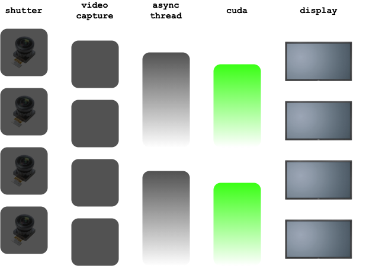

# async-tensorrt

## Overview

The challenge is trying to maintain a 30 fps camera stream when inference time alone takes 40 miliseconds. To solve this, you can create a child thread for processing frames. This allows the main thread to run without being blocked by the Cuda execution.



## Materials

1. [Linux machine with Cuda (see tutorial 0)](https://seanavery.github.io/jetson-nano-box/#/)
2. [JK Jung's TensorRT Demos](https://github.com/jkjung-avt/tensorrt_demos)
3. [Multithreaded Python](https://docs.python.org/3.6/library/threading.html)
4. [TensorRT Documentation](https://docs.nvidia.com/deeplearning/tensorrt/api/index.html#python)
5. [PyCuda Documentation](https://documen.tician.de/pycuda/)

## Procedure

The code is a modification from the async exeuction in [JK Jung's TensorRT Demos](https://github.com/jkjung-avt/tensorrt_demos/blob/master/trt_ssd_async.py). In my code the main thread is responsible for Video Capture and Display, and the child thread handles inference and processing. This allows inference to execute modulus the incoming frames.

### 1. Create Python thread

```
import threading
lock = threading.Lock()

def processor():
    counter = 0
    while True:
      counter += 1

if __name__ == '__main__':
    thread = threading.Thread(target=processor)
    thread.daemon = True
    thread.start()
```

### 2. Initialize Cuda context inside thread

```
def processor():
    cuda_ctx = cuda.Device(0).make_context()
    counter = 0
    while True:
      # run inference
      counter += 1
    del cuda_ctx

```

### 3. Camera capture in main thread

```
def camera_stream():
    pipeline = (
        "nvarguscamerasrc wbmode=1 !"
        "nvvidconv flip-method=2 ! "
        "videoconvert ! video/x-raw, format=(string)BGR !"
        "appsink"
    )
    video_capture = cv2.VideoCapture(pipeline, cv2.CAP_GSTREAMER)
    if video_capture.isOpened():
        modulus = 3
        counter = 0
        while True:
            window = cv2.namedWindow("Camera", cv2.WINDOW_AUTOSIZE)
            _, frame = video_capture.read()
            counter = counter + 1
            if counter % modulus == 0:
                q.put(frame)
            frame = vis.draw(frame, boxes, confs, clss)
            cv2.imshow("Camera", frame)
            keyCode = cv2.waitKey(1) & 0xFF
            if keyCode == 27:
                break
        video_capture.release()
        cv2.destroyAllWindows()
    else:
        print("could not open camera")

if __name__ == '__main__':
    cuda.init()
    thread = threading.Thread(target=processor)
    thread.daemon = True
    thread.start()
    camera_stream()
```

### 4. Queue and modulus to throttle inference

### 5. Locking and global variables

### 6. Visualize inference results from shared state

## Conclusion
